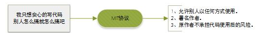
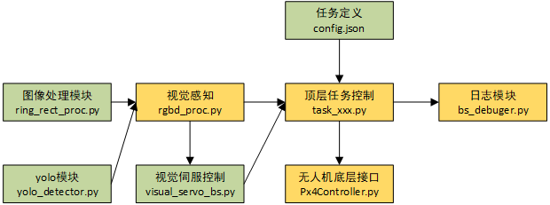
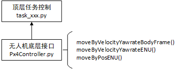
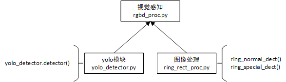
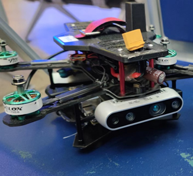
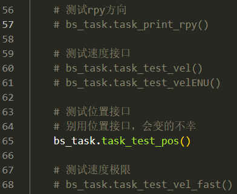
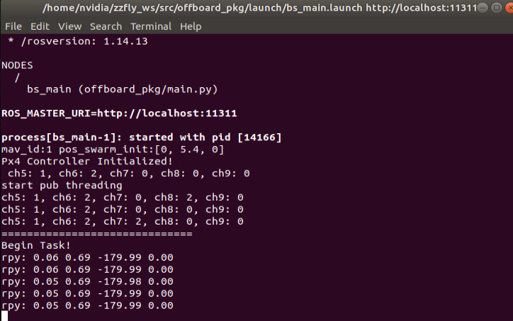

# **[zzfly-2022-real-share](https://github.com/rfly-zzfly/zzfly-2022-real-share)**

2022年智在飞翔线下实飞比赛的代码开源工作。

比赛官网：[无人飞行器智能感知技术竞赛]()

比赛结果：[线下实体赛获奖名单](https://www.robomaster.com/zh-CN/resource/pages/announcement/1554)

采用MIT协议进行开源




## 软件功能介绍

本仓库是2022年智在飞翔线下赛“自主飞行”赛项二的开源例子，受限于时间和论文在投等影响，部分代码会给出示意性的功能代码。

整体框架如图所示，顶层任务通过`config.json`定义，任务相关的参数通过json文件指定。

下图绿色所示的代码模块不依赖于ROS，黄色的模块需要通过ROS进行通信。



完成“自主飞行”赛项二的大概思路如下：

- 将全流程拆解顺序穿越圆环，则圆环的定义以及一些参数存放于`config.json`

- **视觉感知模块**由**图像处理模块**和**yolo模块**组成，子模块不依赖于ROS，可以调试在任意平台上测试完成之后与视觉感知模块联合测试。

- **视觉感知**的解算结果为目标的像素坐标（单位为px）或者目标的实际的物理坐标（单位m）,将目标的坐标特征送入**视觉伺服模块**，解算出控制无人机穿越的速度/位置指令，通过顶层的任务控制选择合适的指令

- **顶层任务控制**向**无人机底层接口**发送速度/位置指令，完成任务穿越

- 为了方便调试和debug，通过**日志模块**记录一些任务的关键参量

  

  **这是一个自上而下的设计模式，从总的任务出发，拆解为子任务，定义子模块的数据流向和具体功能。**

  

  各模块的详细功能介绍如下:

- 任务控制及无人机接口

基于[mavros](http://wiki.ros.org/mavros#Usage)封装了`Px4Controller.py`用于向无人机发送速度和位置指令。




`task_base.py`中定义了一些基础的接口测试任务。可以通过`main.py`进行硬件测试,，通过基本的速度指令和位置指令测试控制无人机硬件是否调试完成。更详细的说明将在**运行说明**章节展示。

- 图像处理

输入RGB的`color_img`和深度图`depth_img`，联合解算，提取圆环/方孔的中心坐标（像素坐标or实际坐标）

- 视觉感知

代理不同方法获得的目标中心坐标，通过不同的选择提供给顶层任务控制和视觉伺服



- 视觉伺服控制

输入目标的中心坐标，输出无人机控制指令，参见论文[1]

- 日志模块

记录关键数据

## 文件组织架构

本项目的文件组织架构如下

```
.
├── LICENSE			使用MIT协议开源
├── offboard_pkg	完成任务用的ros包，命名为offboard_pkg
└── _scripts		一些好用的脚本
```

`_scripts`目录架构

```
_scripts
├── bag_fix.sh				修复rosbag的脚本
└── zzfly_startup.sh		整个项目的自启脚本，方便一键运行和开机自启
```

`offboard_pkg`目录架构

```
offboard_pkg
├── scripts							完成任务的相关功能文件
├── launch
│   ├── bs_d435i_30hz.launch		用于启动d435i的launch
│   ├── bs_main.launch				用于启动主程序的launch
│   └── bs_t265_bridge.launch		用于启动t265的launch
├── package.xml						ROS包的描述文件
└── CMakeLists.txt					ROS包的编译Cmake文件

```

`offboard_pkg/scripts`的目录架构

```
offboard_pkg/scripts
├── bs_debuger.py				日志模块，发送string，rosbag记录
├── config.json					任务配置文件
├── main.py						基本接口和任务框架演示的main函数
├── Px4Controller.py			无人机底层接口封装
├── rgbd_proc.py				视觉感知模块
├── ring_rect_proc.py			圆环和方孔的处理模块
├── task_base.py				任务框架
├── utils.py					一些工具函数
├── visual_servo_bs.py			视觉伺服定义
├── darknet.py					python调用darknet的yolo
└── yolo_detector.py			darknet实现的yolo，封装好的识别器，直接调用就行
```

有关yolo的部分参见**运行说明**章节的**yolo模块**部分。

## 运行说明

### 硬件平台说明

**硬件**：250轴距机架

**飞控**：Pixhawk Nano

**相机**：Intel Realsense D435i + Intel Realsense T265

**边缘计算：**Nvidia Jetson NX



### 环境搭建

下述环境搭建基于Nvidia Jetson NX，普通的ubuntu也适用

- 系统安装

使用的是Jetson的边缘计算平台，参照[官方文档](https://developer.nvidia.com/embedded/learn/getting-started-jetson)烧写系统。

SD卡版本的核心板看这里：[Getting Started With Jetson Xavier NX Developer Kit](https://developer.nvidia.com/embedded/learn/get-started-jetson-xavier-nx-devkit)

EMMC版本的核心板看这里：[Jetson Developer Kits and Modules Quick Start](https://docs.nvidia.com/jetson/archives/l4t-archived/l4t-3261/index.html)

本项目使用的是Jetpack 4.6.2

- 安装ROS

参见[Ubuntu install of ROS Noetic](http://wiki.ros.org/noetic/Installation/Ubuntu)

国内安装可能会有问题，推荐运行一键安装脚本

```
wget https://gitee.com/FHSY/ubuntu-scripts/raw/master/ROS/install-ros.sh
chmod +x install-ros.sh
# 使用清华源安装ROS
./install-ros.sh --tuna
# 在华南地区用上交源好像更快
./install-ros.sh --sjtu
```

- 安装librealsense和realsense-ros

本项目使用的版本为librealsense v2.5.0和realsense-ros 2.3.2

librealsense: https://github.com/IntelRealSense/librealsense

realsense-ros: https://github.com/IntelRealSense/realsense-ros

```
wget https://github.com/IntelRealSense/librealsense/archive/refs/tags/v2.50.0.tar.gz
mkdir librealsense-2.50.0/build
cd librealsense-2.50.0/build
# 和buildLibrealsense保持一致
cmake .. -DCMAKE_BUILD_TYPE=release -DFORCE_RSUSB_BACKEND=true -DBUILD_WITH_CUDA=true -DBUILD_EXAMPLES=true
make -j6
sudo make install
```

- 安装px4_realsense_bridge

```
mkdir -p ~/catkin_ws/src
cd ~/catkin_ws/src
git clone https://github.com/rfly-zzfly/px4_realsense_bridge.git
cd ~/catkin_ws
catkin_make
catkin_make install
```

将`install`目录中三个目录拷贝至`/opt/ros/melodic`

**至此，环境配置完成**

### 运行程序

下载本项目代码并编译

```
mkdir -p ~/zzfly_ws/src
cd ~/zzfly_ws
git clone https://github.com/rfly-zzfly/zzfly-2022-real-share.git src
catkin_make
```

新建存放bag的目录

```
mkdir -p ~/zzfly_ws/bag
```

然后就可以通过一键运行脚本运行

```
./src/_scripts/zzfly_startup.sh
```

没啥报错的话（应该也不会有,有的话再说）

等待`bs_main.launch`出现`start pub vel`字样

遥控器CH7设置为高即自动开始任务。

**第一次测试建议啥任务都不加，只运行一个起飞后悬停几秒然后降落的测试**

### 运行说明

比较核心的就是`roslaunch offboard_pkg bs_main.launch`

其中的`type="main.py"`指定了`bs_main.launch`运行的对象

然后尝试取消注释相关的任务进行测试



可用的测试：

```
task_print_rpy()			打印RPY的角度值
task_test_vel()				测试FLU系下的速度指令
task_test_velENU()			测试ENU系下的速度指令
task_test_pos()				位置控制指令，好像有点问题
```

**TODO**

测试连续的穿环，可以将运行对象改为`type="main_cross.py"`

### 图像处理模块

根据RGB图和深度图提取目标圆环的中心

核心为`ring_rect_proc()`函数，会根据传入的参数不同，用不同的方法处理颜色图和深度图

### 视觉感知模块

核心为任务函数中在循环中调用`img_proc.update_ring_info()`或者`img_proc.update_yolo_xyr()`更新目标的参数。目标参数可以通过`img_proc.circle_xyr`或者`img_proc.circle_FRD`进行获取

## 视觉伺服控制

**TODO**

### yolo模块

**TODO**

使用的darknet框架的yolo

## 软件效果展示

### task_print_rpy()



### task_test_vel()

无人机前飞，左飞，旋转后，后飞，左飞


### task_test_pos()

**TODO**

多少有点问题现在，回头调试好了上demo

### task_test_vel_fast()

8m/s的最大速度测试（硬件的极限可能是16-20m/s）


### task_two_ciecle()

连续穿越两个环


### 任务全流程

单击图片播放

[](https://www.bilibili.com/video/BV1mR4y1r7EL)

## 未来优化的方向

未来有时间和精力继续维护本项目的话会往一下几个方向优化

- 填坑：把现有的工作整理为论文并完善代码
- 新速度：在现有的视觉RGBD感知下，提升速度，目前平均速度1m/s，期望可以接近人类业余飞手的2m/s甚至人类专业飞手的6m/s
- 新传感器：引入固态激光雷达，使用LIO定位和感知（不过激光雷达好像很重的样子）
- 新方法：
  - 对环境进行先验建图，类似于r3live的环境扫描，在已知环境，未知定位的情况下尝试
  - 迭代学习

## 参考资料

[1] Yang K, Quan Q. An autonomous intercept drone with image-based visual servo[C]//2020 IEEE International Conference on Robotics and Automation (ICRA). IEEE, 2020: 2230-2236.